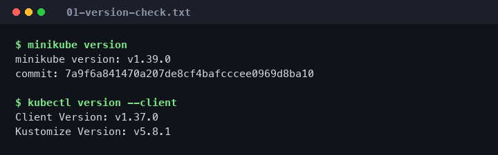
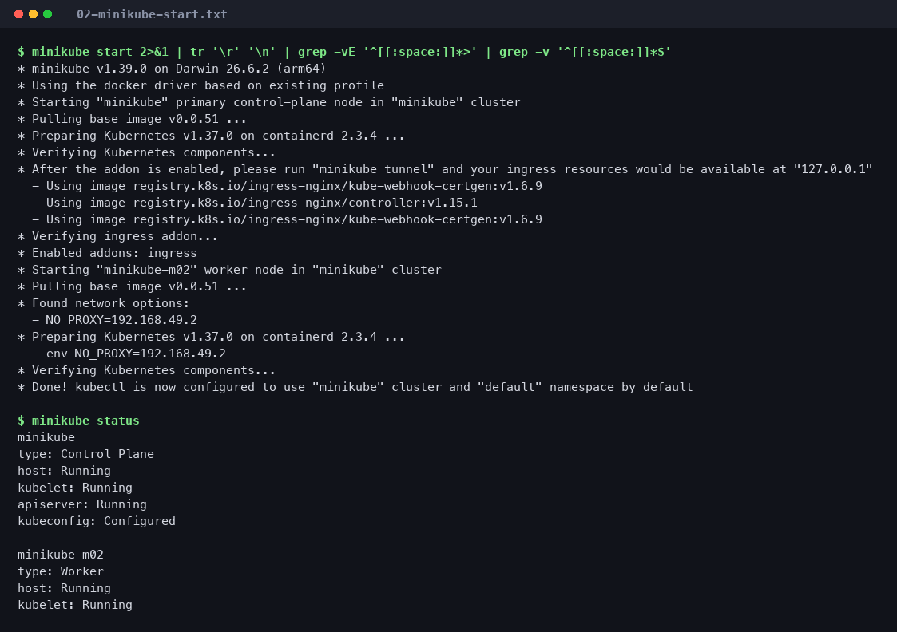
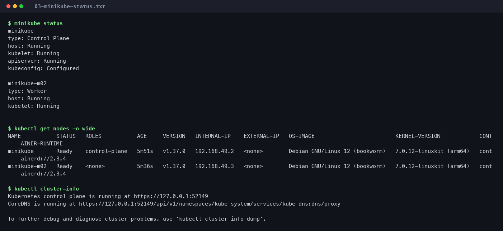
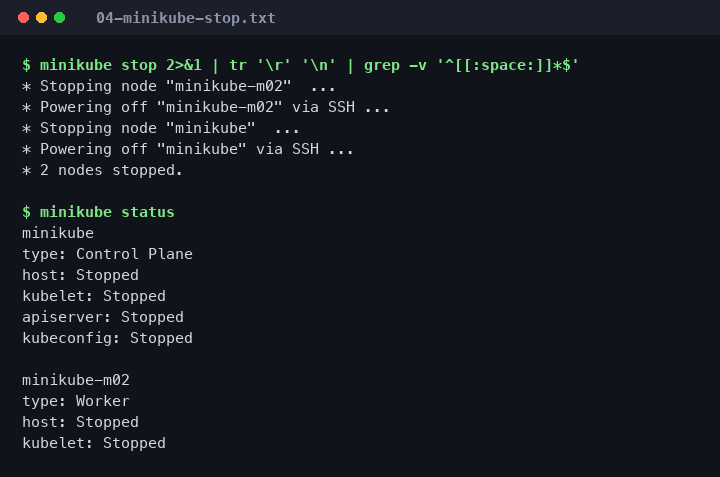

# Session 9 — Kubernetes Fundamentals & Cluster Architecture

**Name:** THRISHAL DOMA
**Enrollment Number:** 24BCS10097
**Course:** SST DevOps & Cloud [SWE]
**Repository path:** `session9-k8s/`
**Environment:** macOS 26.6.2 (arm64, Apple Silicon) · Docker Desktop Engine 29.7.2 · minikube v1.39.0 · Kubernetes v1.37.0

---

## How to read this submission

Every command below was actually executed on this machine. The output shown is the
real captured output, not a transcript copied from the slides — which is why the
versions are minikube v1.39.0 / Kubernetes v1.37.0 rather than the v1.33 / v1.30
used in the lecture example.

| Evidence | Location |
|---|---|
| Full terminal transcripts | [`logs/`](./logs) |
| Screenshots | [`screenshots/`](./screenshots) |

> **Note on screenshots:** the PNGs in `screenshots/` are rendered from the exact
> transcripts in `logs/`. The underlying output is genuine; only the presentation
> is generated. The `.txt` files are the primary evidence.

### Environment notes

- The cluster is started with **two nodes** (`--nodes=2`). A single-node cluster
  cannot demonstrate several later exercises (a DaemonSet scheduling one pod *per
  node*, or a NodePort answering on a node that hosts no pod), so the extra node
  is carried through Sessions 10–12 as well.
- `minikube status` therefore reports **two blocks** — one for the control plane
  and one for the worker — instead of the single block shown in the lecture.

---

## Task 1 — Minikube & kubectl installation verification

Confirm that both binaries are installed and report their versions.

```bash
minikube version
kubectl version --client
```

**Output**

```
$ minikube version
minikube version: v1.39.0
commit: 7a9f6a841470a207de8cf4bafcccee0969d8ba10

$ kubectl version --client
Client Version: v1.37.0
Kustomize Version: v5.8.1
```

📄 Full log: [`logs/01-version-check.txt`](./logs/01-version-check.txt)
📸 

---

## Task 2 — Starting the Minikube cluster

Bring up a local Kubernetes cluster using the Docker driver.

```bash
minikube start
```

**Output** (progress-bar lines stripped for readability)

```
* minikube v1.39.0 on Darwin 26.6.2 (arm64)
* Using the docker driver based on existing profile
* Starting "minikube" primary control-plane node in "minikube" cluster
* Pulling base image v0.0.51 ...
* Preparing Kubernetes v1.37.0 on containerd 2.3.4 ...
* Verifying Kubernetes components...
* Enabled addons: ingress
* Starting "minikube-m02" worker node in "minikube" cluster
* Preparing Kubernetes v1.37.0 on containerd 2.3.4 ...
* Verifying Kubernetes components...
* Done! kubectl is now configured to use "minikube" cluster and "default" namespace by default
```

> **Provenance of this transcript.** It was captured on the start that *follows*
> Task 4's `minikube stop`, so it reads `based on existing profile` and lists
> `Enabled addons: ingress` (enabled later, for Session 12) rather than showing a
> first-time creation. The cluster was created once and reused across Sessions
> 9–12; re-creating it for a tidier log would have discarded that state. The
> original creation used
> `minikube start --nodes=2 --driver=docker --cpus=2 --memory=3000`.

Note the container runtime is **containerd 2.3.4**, not Docker — see the CRI note
in Task 5. Docker is only the *driver* hosting the node; it is not the runtime
running the pods.

📄 Full log: [`logs/02-minikube-start.txt`](./logs/02-minikube-start.txt)
📸 

---

## Task 3 — Verifying cluster status and node health

Check the control-plane components and confirm every node reaches `Ready`.

```bash
minikube status
kubectl get nodes -o wide
kubectl cluster-info
```

**Output**

```
$ minikube status
minikube
type: Control Plane
host: Running
kubelet: Running
apiserver: Running
kubeconfig: Configured

minikube-m02
type: Worker
host: Running
kubelet: Running

$ kubectl get nodes -o wide
NAME           STATUS   ROLES           AGE     VERSION   INTERNAL-IP    EXTERNAL-IP   OS-IMAGE                         KERNEL-VERSION            CONTAINER-RUNTIME
minikube       Ready    control-plane   5m51s   v1.37.0   192.168.49.2   <none>        Debian GNU/Linux 12 (bookworm)   7.0.12-linuxkit (arm64)   containerd://2.3.4
minikube-m02   Ready    <none>          5m36s   v1.37.0   192.168.49.3   <none>        Debian GNU/Linux 12 (bookworm)   7.0.12-linuxkit (arm64)   containerd://2.3.4

$ kubectl cluster-info
Kubernetes control plane is running at https://127.0.0.1:52149
CoreDNS is running at https://127.0.0.1:52149/api/v1/namespaces/kube-system/services/kube-dns:dns/proxy
```

The worker's `ROLES` column shows `<none>`: "worker" is not a role Kubernetes
assigns, it is simply a node with no control-plane label.

📄 Full log: [`logs/03-minikube-status.txt`](./logs/03-minikube-status.txt)
📸 

---

## Task 4 — Stopping the cluster

Shut the cluster down cleanly to release CPU and memory.

```bash
minikube stop
minikube status
```

**Output**

```
$ minikube stop
* Stopping node "minikube-m02"  ...
* Powering off "minikube-m02" via SSH ...
* Stopping node "minikube"  ...
* Powering off "minikube" via SSH ...
* 2 nodes stopped.

$ minikube status
minikube
type: Control Plane
host: Stopped
kubelet: Stopped
apiserver: Stopped
kubeconfig: Stopped

minikube-m02
type: Worker
host: Stopped
kubelet: Stopped
```

`minikube stop` powers the nodes off but **preserves** them — the cluster state,
downloaded images and any deployed objects survive, and `minikube start` resumes
the same cluster. `minikube delete` is the destructive counterpart.

📄 Full log: [`logs/04-minikube-stop.txt`](./logs/04-minikube-stop.txt)
📸 

---

## Task 5 — Kubernetes architecture & core components

*Documentation task — no commands. Source: the official
[Kubernetes Architecture documentation](https://kubernetes.io/docs/concepts/architecture/).*

A cluster splits into a **control plane** that decides what should be running, and
**worker nodes** that actually run it. The control plane never runs your
containers; the workers never make scheduling decisions.

```
+---------------------------------------------------------------+
|                     CONTROL PLANE (minikube)                  |
|                                                               |
|   +-----------+      +------------------+     +-----------+   |
|   |   etcd    |<---->|  kube-apiserver  |<--->| scheduler |   |
|   | (state)   |      |   (front door)   |     +-----------+   |
|   +-----------+      +---------+--------+                     |
|                                |                              |
|                                v                              |
|                  +--------------------------+                 |
|                  | kube-controller-manager  |                 |
|                  +--------------------------+                 |
+--------------------------------+------------------------------+
                                 |  (watch / report)
                                 v
+---------------------------------------------------------------+
|                  WORKER NODE (minikube-m02)                   |
|                                                               |
|     +-----------+        +--------------+                     |
|     |  kubelet  |        |  kube-proxy  |                      |
|     +-----+-----+        +------+-------+                     |
|           |                     |                             |
|           v                     v                             |
|     +-------------------------------------+                   |
|     |   containerd (CRI)                  |                   |
|     +-------------------------------------+                   |
|           |                                                   |
|           v                                                   |
|     +-----------+   +-----------+                             |
|     |   Pod A   |   |   Pod B   |                             |
|     +-----------+   +-----------+                             |
+---------------------------------------------------------------+
```

### Control plane components

| Component | What it does |
|---|---|
| **kube-apiserver** | The only front door. Every request — `kubectl`, the dashboard, and the internal controllers alike — is authenticated, authorised and validated here. It is also the **only** component that talks to `etcd`. |
| **etcd** | A distributed key-value store holding the entire cluster state: every object spec, status and Secret. Losing `etcd` means losing the cluster; it is the thing you back up. |
| **kube-scheduler** | Watches for Pods with no `nodeName` assigned and picks a node, weighing resource requests, affinity/anti-affinity, taints and tolerations. It only *writes the decision* — it does not start anything. |
| **kube-controller-manager** | Runs the reconciliation loops that continuously compare **desired state vs actual state** and act on the difference. Includes the Node, ReplicaSet, Deployment and EndpointSlice controllers. |

### Worker node components

| Component | What it does |
|---|---|
| **kubelet** | The node's agent. Receives PodSpecs from the API server, tells the container runtime to pull images and start containers, runs liveness/readiness/startup probes, and reports status back. |
| **kube-proxy** | Implements Services. Programs `iptables`/IPVS rules so that a Service's virtual IP load-balances across the current set of healthy Pod IPs. |
| **Container runtime (CRI)** | Actually runs containers. This cluster uses **containerd 2.3.4**. Kubernetes removed the built-in Docker shim in v1.24; modern clusters speak the CRI to containerd or CRI-O. |
| **Pod** | The smallest deployable unit: one or more containers that share a network namespace (one IP, one port space) and can share volumes. |

### How they interact — creating one Pod

1. `kubectl apply` → **kube-apiserver** validates the object and writes it to **etcd**. The Pod now exists with no node assigned.
2. **kube-scheduler** notices the unassigned Pod, picks a node, and writes that binding back through the API server.
3. The **kubelet** on the chosen node sees a Pod bound to it, and asks **containerd** to pull the image and start the container.
4. The kubelet reports status back to the API server; **kube-proxy** updates its rules if the Pod is now a Service endpoint.

The pattern to notice: components never call each other directly. They all watch
the API server and write back to it. That is what makes the system resilient —
any component can restart and simply resume from the state in `etcd`.

*Observed in this cluster:* in Session 10 a Pod was created and landed on
`minikube-m02` (step 2's decision), visible as the `NODE` column in
[`../session10-k8s-core-objects/logs/02-nginx-pod-operations.txt`](../session10-k8s-core-objects/logs/02-nginx-pod-operations.txt).

---

## Reproducing this session

```bash
minikube start --nodes=2 --driver=docker --cpus=2 --memory=3000
minikube status
kubectl get nodes -o wide
minikube stop
```
